### Advanced Lane Finding Project
The goals / steps of this project are the following:
*	Compute the camera calibration matrix and distortion coefficients given a set of chessboard images.
*	Apply a distortion correction to raw images.
*	Use color transforms, gradients, etc., to create a thresholded binary image.
*	Apply a perspective transform to rectify binary image ("birds-eye view").
*	Detect lane pixels and fit to find the lane boundary.
*	Determine the curvature of the lane and vehicle position with respect to center.
*	Warp the detected lane boundaries back onto the original image.
*	Output visual display of the lane boundaries and numerical estimation of lane curvature and vehicle position.

All code referenced in this write up is contained in the AdvancedLaneLines Jupyter notebook contained in this submission.
Here I will consider the rubric points individually and describe how I addressed each point in my implementation.


Camera Calibration
1. Briefly state how you computed the camera matrix and distortion coefficients. Provide an example of a distortion corrected calibration image.

The code to calibrate the camera is contained in the CalibrateCamera function.  This functions looks for all images called “calibration*.jpg” in the ‘camera_cal’ folder.  This uses a 9X6 chessboard to calibrate the camera.  I saved the camera matrix and distortion info to a pickle file.  I found calibrating the camera each time I ran the project was very time consuming.  I check to see if the pickle file exists, and if it does I load the values from it.  If it doesn’t exist, then I go ahead and calibrate the camera. 


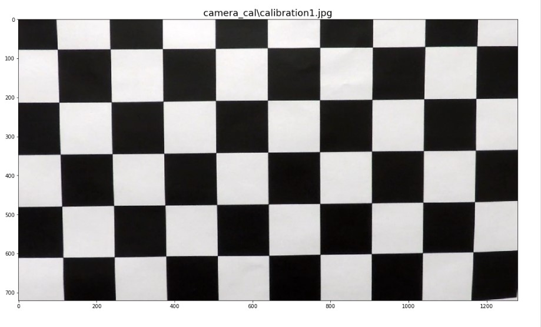 
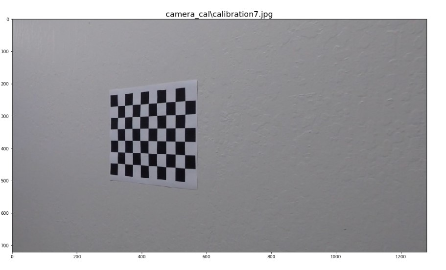

## Pipeline (single images)

##### Provide an example of a distortion-corrected image.

To demonstrate this step, I will describe how I apply the distortion correction to one of the test images.
To undistort the image, I used the camera calibration obtained in the previous step and used cv2.undistort() to undistort the image.  


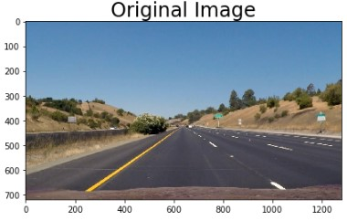 
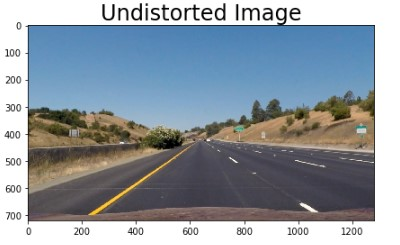

##### Describe how (and identify where in your code) you used color transforms, gradients or other methods to create a thresholded binary image. Provide an example of a binary image result.

For this step, I used a number of different methods before finally settling on one which worked pretty well.  Originally, I used the methods shown in class, where we got the gradient of x and y, as well as the magnitude and direction of the gradient.  I received very mixed results with this.  I then watched the P$ Q&A video and decided to go with the gradients of X and Y, and do a color threshold using the S channel of a HLS image, and the V channel of a HSV image.  This produced very clean and crisp results.

Once I did this, I ran in to another problem.  When the images were undistorted the lines could get blurry.  This caused them to not show up when I did the gradient and color work on a warped image.  I originally thought it would be more efficient to do the threshold and gradient work on the warped image, being it had less ‘data’ in it.  I found I was wrong, and it worked a lot better when I did the gradient and threshold work on the full image, and then perform the image warp. Warping of the image is described in the next section


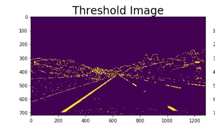 
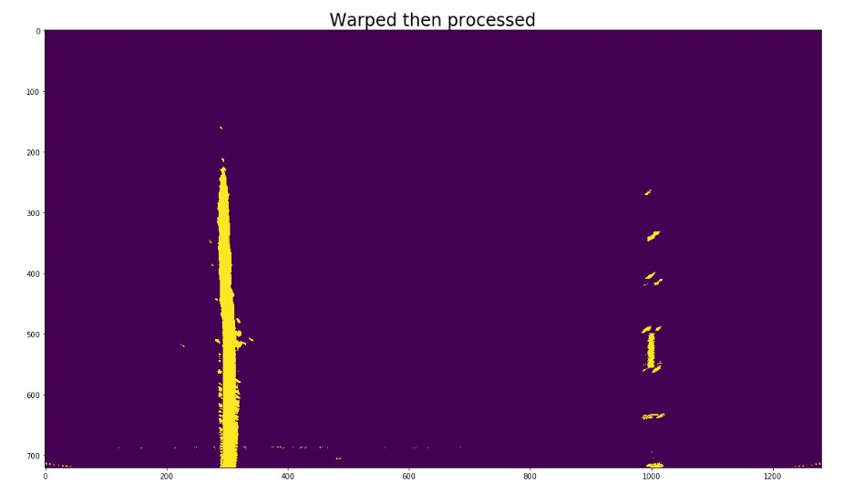
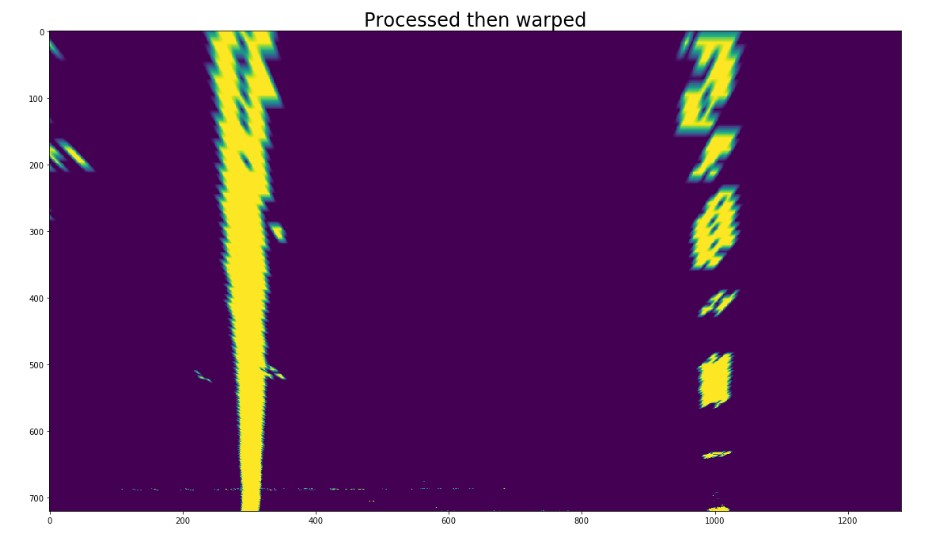 

3. Describe how (and identify where in your code) you performed a perspective transform and provide an example of a transformed image.
The perspective transform (warp) was performed using dynamic points which can change with the size of the image. I used an offset of 15% of the image size.  I also used points similar to what I used for the mask in the first lane finding project:
```sh
    botWidth = .76 – this is the width of the bottom of the trapezoid
    midWidth = .08 – this is the width of the top of the trapezoid
    heightPct = .62 – this is the height of the trapeziod
    bottomTrim = .935 – this trims the hood of the car off
    src = np.float32([[img_size[0]*(.5-midWidth/2), img_size[1]*heightPct],
                      [img_size[0]*(.5+midWidth/2), img_size[1]*heightPct],
                      [img_size[0]*(.5-botWidth/2), img_size[1]*bottomTrim],
                      [img_size[0]*(.5+botWidth/2), img_size[1]*bottomTrim]])
   
    dst = np.float32([[offset, 0],
                      [img_size[0]-offset,0],
                      [offset, img_size[1]], 
                      [img_size[0]-offset, img_size[1]]])  
```
I verified that my perspective transform was working as expected by drawing the src and dst points onto a test image and its warped counterpart to verify that the lines appear parallel in the warped image.


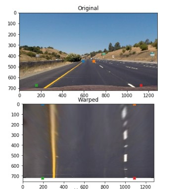 

##### Describe how (and identify where in your code) you identified lane-line pixels and fit their positions with a polynomial?

In order to find the lane pixels I used a function find_window_centroids().  Within this function I use a convolution to identify the highest concentration of pixels in the lower part of the image.  Once the pixels are found, the window can shift around on the next level to the left or right in order to find the rest of the line.  For this function I used a window height of 120px which allows for 6 levels (top to bottom). I originally started with a height of 80px, allowing for 9 windows.  However I found with window sizes that small, sometimes it would lose the right dashed line when there was a break in the line.  Allowing for larger windows allowed it to find the lines much easier.  I chose a window width of 25, and this worked consistently throughout my testing. 
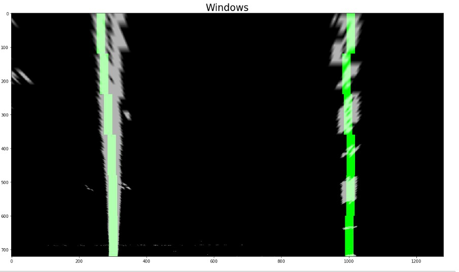 


##### Describe how (and identify where in your code) you calculated the radius of curvature of the lane and the position of the vehicle with respect to center.
In order to calculate the radius of the curve I implemented a function, DetermineCurve().  The first thing this function does is translate pixel space into real world space, using a ratio on the x axis of .005286 meters per pixel (3.7/700). From there it takes the lines we found in the find_window_centroids() function and create a distinct left and right line. In my pipeline I also calculated the position of the vehicle in respect to the center of the lane.  

##### Provide an example image of your result plotted back down onto the road such that the lane area is identified clearly.

The annotation of the image took place in 2 functions. The first, DrawRegion() took the left and right lines, and drew a region on to the original undistorted image.  The second function did more annotation and performed the combining of image.  I took this approach as I wanted to present as much information as possible during the tweaking and troubleshooting of this project.  

The final image is a composite of the original undistorted image with the region drawn on it. I also wrote out the curvature of the lane as well as the offset from center.  I also would add additional information during troubleshooting, such as whether I found dissimilar lines, how many frames I was smoothing over, and if the collection of lines reset due to finding to many dissimilar lines.  There is a warped binary image which shows the overhead view of the lane.  This was very helpful when the lines began to jitter around during early implementation.  This is what helped me to realize I was not getting the full lines when I warped the image prior to creating the binary image.  The final window, in the top right, is simply showing the original undistorted image with the left and right lines I found drawn on them.


Original Image with the region of the lanes drawn.
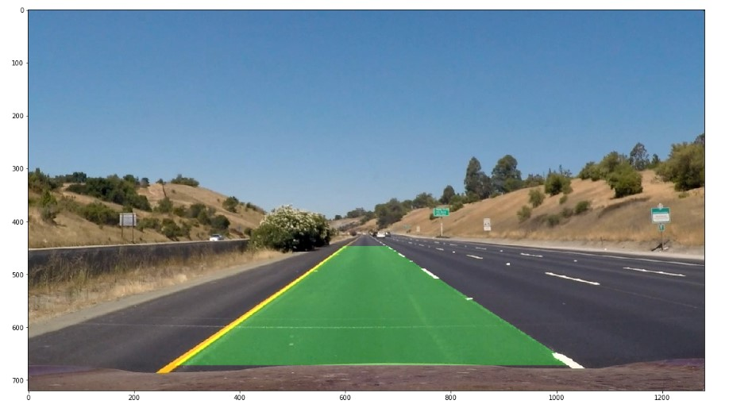 
Final Composite image.
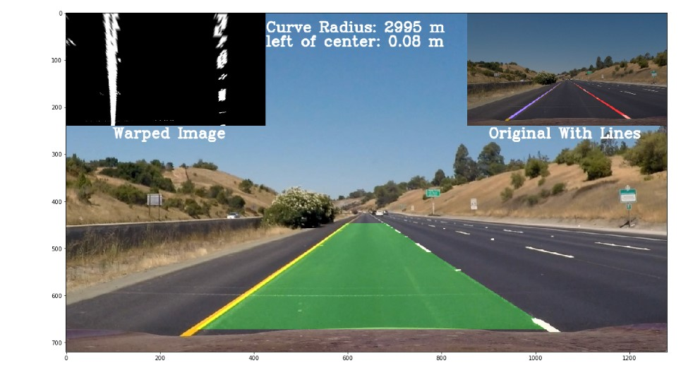 


## Pipeline (video)
##### Provide a link to your final video output. Your pipeline should perform reasonably well on the entire project video (wobbly lines are ok but no catastrophic failures that would cause the car to drive off the road!).

The video for this project is project_video_out.mp4 which is contained in the files I submitted. 

#### Discussion

##### Briefly discuss any problems / issues you faced in your implementation of this project. Where will your pipeline likely fail? What could you do to make it more robust?

Where to begin? This project was complicated and I went through many iterations (many of my deprecated functions are still contained in the Jupyter Notebook). I found this project was a lot of trial and error.  I would like to improve my lane tracking and sanity check in the future.  As they stand now, the lane tracking  function, SmoothLines(), does a decent job of keeping a running average of the last 10 lines gathered.  It also implements a ‘sanity check’ called DetermineIfSimilar().  This function checks if we even found a line, if the radius of the line is within a specific deviation.  SmoothLines() also has a final check in it.  It will look at the distance between the lines and ensure it fits a 4 meter width ± 1 meter.  
The overall hardest part was finding the lines when I warped the image before processing it.  I feel if I had gone with the process then warp pipeline earlier, I would have completed this project in half the time. 

